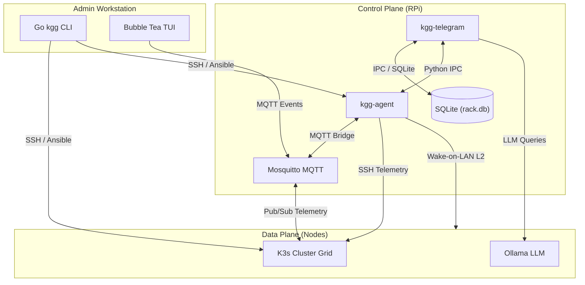
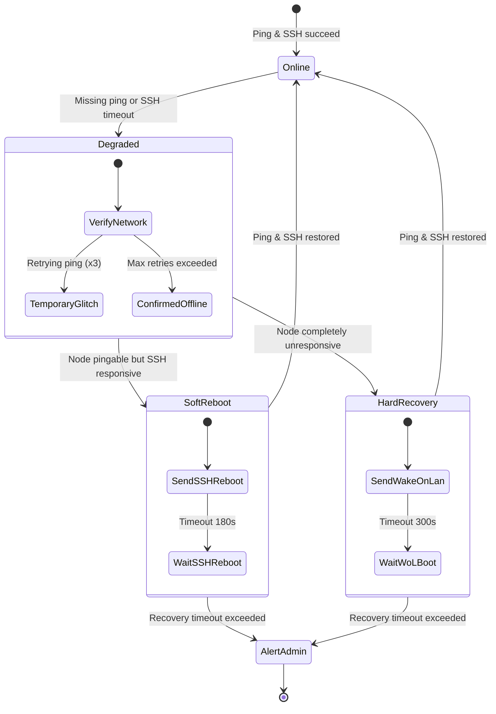

# 🧠 System Architecture: Kuargogo (`kgg`)

This document provides a deep dive into the software architecture, communications topology, state management, and security model of **Kuargogo (`kgg`)**.

---

## 🏛️ Core Architecture Philosophy

Kuargogo is designed around a **Dual-Plane Separation** model. By dividing the system into distinct control and data pathways, the homelab achieves maximum uptime, secure remote orchestrations, and automated recovery loops, all while remaining highly power-efficient.

```
                  ┌─────────────────────────────────────┐
                  │      Admin Workstation (Laptop)     │
                  │       Go CLI / Bubble Tea TUI       │
                  └──────────────────┬──────────────────┘
                                     │ SSH (Agentless)
                                     ▼
┌────────────────────────────────────────────────────────────────────────┐
│ CONTROL PLANE (Lightweight Bastion Host - RPi)                          │
│                                                                        │
│   ┌─────────────────────┐             ┌────────────────────────────┐   │
│   │    kgg-telegram     │ <─────────> │         kgg-agent          │   │
│   │  (Telegram Daemon)  │   Python    │  (Heartbeats & Recovery)   │   │
│   └──────────┬──────────┘    IPC      └──────────────┬─────────────┘   │
│              │                                       │                 │
│              ▼                                       ▼                 │
│      [ SQLite DB ]                            [ Mosquitto MQTT ]       │
└──────────────┬───────────────────────────────────────┬─────────────────┘
               │                                       │
               │ SSH Orchestrations                    │ MQTT Telemetry
               ▼                                       ▼
┌────────────────────────────────────────────────────────────────────────┐
│ DATA PLANE (Compute Grid & Storage)                                    │
│                                                                        │
│   ┌───────────────────────────┐             ┌──────────────────────┐   │
│   │         HP Node           │             │     Lenovo Node      │   │
│   │  K3s Master / NFS Storage │ <─────────> │ K3s Worker / CUDA AI │   │
│   └───────────────────────────┘             └──────────────────────┘   │
└────────────────────────────────────────────────────────────────────────┘
```

---

## 🧬 System Planes & Components

### 1. The Management Workstation (`kgg` CLI/TUI)
Your local computer acts as the administrative terminal.
*   **Cobra CLI & Bubble Tea TUI**: Built in Go, it delivers compiled, high-performance execution.
*   **Agentless Orchestrator**: Uses SSH and Ansible playbooks to provision, modify, and build clusters remotely. It does not require any background daemons running on your workstation.
*   **Transparent WSL Bridge**: On Windows, it handles key synchronization (`0600` permissions) and tunnels Ansible playbooks into a native WSL Ubuntu instance automatically.

### 2. Control Plane: "The Brain" (Raspberry Pi Bastion)
A low-power, always-on Raspberry Pi 3/4/5 that coordinates background actions and acts as the gatekeeper.
*   **`kgg-agent` (Python Daemon)**: The central processing hub. It manages periodic node heartbeat monitors, monitors cluster states, and runs self-healing cron loops.
*   **`kgg-telegram` ("The Voice")**: A persistent daemon managing long-poll Telegram Bot API connections. It acts as an out-of-band console to control and check the homelab from anywhere.
*   **Mosquitto MQTT Broker**: Facilitates internal telemetry messaging and event-bridge pub/sub protocols.

### 3. Data Plane (Compute Node-Grid)
High-performance compute platforms hosting application workloads.
*   **Workload Orchestrator**: A lightweight K3s Kubernetes cluster.
*   **Distributed Storage**: Longhorn dynamic volume pools paired with persistent NFS storage shares.
*   **GPU Workloads**: CUDA-ready nodes hosting containerized Ollama AI inference models.

---

## ⚡ Communications Topology

Kuargogo employs distinct communications channels designed for specific reliability and security boundaries:



---

## 🔄 Self-Healing State Machine

The `kgg-agent` running on the Raspberry Pi maintains a resilient self-healing state machine to recover frozen or crashed nodes:



### Heartbeat Resolution Steps
1.  **Detection**: If a node fails a standard network ping or SSH handshake, it enters the `Degraded` state.
2.  **Verification**: The agent executes a 3-pass verification cycle over 60 seconds to rule out network jitter.
3.  **SSH Soft Reboot**: If the host responds to pings but has a broken SSH daemon or high system freeze, the agent attempts to trigger an SSH shutdown/reboot command.
4.  **WoL Hard Boot**: If the node is completely down or dead, a layer-2 Wake-on-LAN magic packet is broadcast to boot the bare-metal hardware.
5.  **Alert Escalation**: If the node fails to return to `Online` status within its allotted boot window, a priority alert is pushed to your Telegram device.

---

## 🌐 Layer 2 Network Management

Kuargogo manages your physical and logical network routing seamlessly:
*   **Port-Mapping Source of Truth**: Define your physical network cabling, VLAN maps, and port speeds declaratively in `kuargogo.yaml`.
*   **Active MAC Validation**: The CLI scans your network and queries the smart switches to verify that physical patch cables match the configured ports.
*   **Extensible Network Drivers**: Pluggable switch adapters are supported via a clean interface:
    ```go
    type SwitchDriver interface {
        GetPortStatus() ([]PortMetrics, error)
        ApplyVLANConfig(cfg VLANMap) error
        Reboot() error
    }
    ```
    *Core drivers are provided for TP-Link Omada, MikroTik SwOS/RouterOS, and simulated development switch templates.*

---

## 🛡️ Threat Model & Security Architecture

Kuargogo is open-source friendly. It allows you to publish your pipeline repositories publicly while maintaining strict defense-in-depth security on your home hardware.

### 1. Symmetric Vault Encryption
All critical credentials (passwords, tokens, API keys) are encrypted inside `kuargogo.yaml` using AES-256-GCM. The decryption key is locked inside your OS's hardware-backed keyring, keeping your raw files safe even if shared publicly.

### 2. Out-of-Band Telegram Whitelisting
To prevent unauthorized access to your system bot, the `kgg-telegram` daemon enforces a strict, zero-trust whitelisting middleware:
```python
AUTHORIZED_USER_ID = int(os.getenv('TELEGRAM_ADMIN_ID'))

def on_message(msg):
    # Strict validation of Telegram User ID
    if msg.from_user.id != AUTHORIZED_USER_ID:
        log_security_event(msg.from_user.id)
        return  # Silent ignore (does not acknowledge bot existence)
    
    process_authorized_command(msg)
```

### 3. Zero-Trust Cloudflare Ingress
All external traffic to local services (e.g. Grafana dashboards or ArgoCD UIs) enters securely via outbound-only Cloudflare Zero Trust Tunnels.
*   No inbound firewall ports are opened on your router.
*   Authentication is enforced globally at the Cloudflare Edge using secure Email One-Time Password (OTP) verification before requests reach your local servers.
