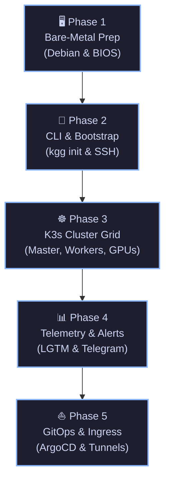

# 📖 Deployment Master Portal: Kuargogo (`kgg`)

Welcome to the **Kuargogo (`kgg`) Deployment Portal**. This comprehensive roadmap leads you step-by-step from raw, unformatted bare-metal machines to a fully-hardened, High-Availability K3s Kubernetes Cluster integrated with local LLMs, GitOps pipelines, and secure out-of-band monitoring.

---

## 🗺️ The Deployment Roadmap

The deployment pipeline is organized into five structured phases. Follow them sequentially to ensure a robust, production-ready environment:



---

## 🗺️ Master Portal Index

| Phase | Target Module Guide | Focus Objectives | Est. Duration |
| :--- | :--- | :--- | :--- |
| **Phase 1** | 🖥️ [01. Hardware & OS Setup](file:///e:/Development/kuargogo/internal/help/docs/01-hardware-preparation.md) | BIOS configurations, static IP definitions, and vanilla Debian server installation. | 1 - 2 Hours |
| **Phase 2** | 🛠️ [02. CLI & Node Bootstrap](file:///e:/Development/kuargogo/internal/help/docs/02-provisioning.md) | Initializing `kuargogo.yaml`, secure SSH keygen/copies, and node agent provisioning. | 30 - 45 Mins |
| **Phase 3** | ☸️ [03. Cluster & Storage Deploy](file:///e:/Development/kuargogo/internal/help/docs/03-cluster-and-services.md) | Initializing K3s Master, worker joins, Longhorn volumes, and CUDA Ollama setups. | 20 - 30 Mins |
| **Phase 4** | 📊 [04. Observability Stack](file:///e:/Development/kuargogo/internal/help/docs/04-observability.md) | Deploying Grafana LGTM engines and provisioning metrics telemetry collection. | 15 - 20 Mins |
| **Phase 4b**| 🤖 [05. Telegram Bot Whitelist](file:///e:/Development/kuargogo/internal/help/docs/05-telegram-setup.md) | Connecting and hardening "The Voice" bot telegram notifications for the Pi. | 10 Mins |
| **Phase 5** | ⛵ [06. GitOps & Secrets Management](file:///e:/Development/kuargogo/internal/help/docs/06-gitops-and-secrets.md) | Deploying ArgoCD projects, git repositories, and pipeline secrets. | 20 Mins |
| **Phase 5b**| 🌐 [07. Cloudflare Zero Trust Ingress](file:///e:/Development/kuargogo/internal/help/docs/07-cloudflare-zero-trust.md) | Configuring secure outbound tunnels and OTP application security policies. | 15 Mins |

---

## ⚡ Express Deployment (Advanced SREs)

If you already have your node grid formatted with Debian, target SSH credentials configured, and an active `kuargogo.yaml` schema populated, you can skip the interactive phases and orchestrate the entire deployment pipeline with a single unified call:

```bash
kgg site
```

> [!WARNING]
> If your workers contain dedicated storage pools configured for Longhorn, ensure you mount them via `kgg mount-storage` **before** running `kgg site` to ensure paths bind correctly.

For in-depth parameters on fast-path deployments, review the [Express Deploy Reference](file:///e:/Development/kuargogo/internal/help/docs/02-provisioning.md#-atajo-despliegue-express-kgg-site).

---

## 🔒 Post-Deployment Security Hardening

After successfully bringing your cluster online, ensure you apply these security protocols:

1.  **Disable Password Authentications**: Harden all nodes' SSH daemons to reject raw password authentications:
    ```bash
    kgg ssh <node-name> "sudo sed -i 's/#PasswordAuthentication yes/PasswordAuthentication no/g' /etc/ssh/sshd_config && sudo systemctl restart sshd"
    ```
2.  **Verify Sudo Keying**: Open `kgg`, navigate to **🔐 Security & Vault**, and define your Master Passphrase to secure your local secrets at rest immediately.

---

## 📚 Global Reference Guides

To research specific operations, command arguments, or telemetry architectures, refer to the master system files:

*   📖 **[COMMANDS.md](COMMANDS.md)**: Full syntax definitions and command examples for the CLI.
*   🧠 **[ARCHITECTURE.md](ARCHITECTURE.md)**: Software layer charts, telemetry flows, and self-healing systems.
*   🚀 **[README.md](../README.md)**: Main landing page, Quick Start references, and compilation guides.
