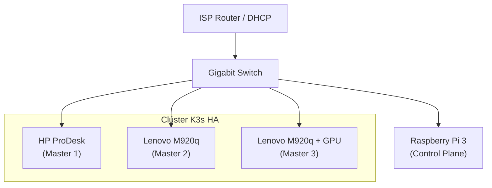

# 🖥️ Guía 1: Preparación del Hardware

> [!TIP]
> **Hoja de Ruta**: Antes de empezar, te recomendamos leer la [00-workflow-roadmap.md](00-workflow-roadmap.md) para entender el flujo estratégico del homelab.

> **Tiempo estimado**: 1-2 horas por nodo (instalación de SO incluida)

Esta guía detalla la preparación del hardware necesario para el rack `kuargogo`. El sistema utiliza una arquitectura híbrida:
- **Nodos de Cómputo (X86)**: Equipos HP/Lenovo Mini para el clúster K3s de Alta Disponibilidad.
- **Infrastructure Manager (ARM/RPi)**: Una Raspberry Pi dedicada exclusivamente a la gestión del rack (WoL, MQTT, monitorización), sin carga de Kubernetes.
Al finalizar, tendrás todos tus nodos listos para ser gestionados remotamente.

---

## 📋 1. Hardware Necesario

### Admin PC (Tu equipo de trabajo)
Tu portátil o PC de escritorio desde el que ejecutarás `kuargogo`. Compatible con **Windows, Linux y macOS**.

**Software necesario**:
- [Go](https://go.dev/dl/) 1.26+ (si compilas desde fuente) o el binario precompilado desde [Releases](https://github.com/DannyStrelok/kuargogo/releases)
- [Ansible](https://docs.ansible.com/ansible/latest/installation_guide/) (para los comandos de provisioning y cluster)
- Cliente SSH (incluido en todos los SO modernos)

### Nodos del Clúster
Mínimo **3 nodos** para Alta Disponibilidad (quórum etcd). Ejemplo de configuración:

| Nodo | Hardware | Rol | Notas |
|:---|:---|:---|:---|
| `hp-prodesk` | HP ProDesk 800 G4 | Master | Almacenamiento principal (8TB) |
| `lenovo-1` | Lenovo M920q | Master | |
| `lenovo-2` | Lenovo M920q | Master | GPU Nvidia Tesla P4 (opcional) |

> [!TIP]
> Cualquier PC con arquitectura **x86_64 (amd64)** y al menos **4GB RAM** puede funcionar como nodo. Los modelos listados son un ejemplo; `kuargogo` es agnóstico al hardware.

### Control Plane (Opcional)
Si vas a gestionar hardware físico del clúster o actuar como gestor de infraestructura:
- **Raspberry Pi 3+** — Gestor de infraestructura (RPi)


---

## ⚙️ 2. Configuración de BIOS/UEFI

Accede a la BIOS de **cada nodo de cómputo** antes de instalar el SO.

### Lenovo M920q
*Tecla de acceso*: `F1` al arrancar

| Parámetro | Ruta en BIOS | Valor |
|:---|:---|:---|
| Secure Boot | Security → Secure Boot | **Disabled** |
| Wake on LAN | Devices → Network Setup → Wake on LAN | **Enabled** |
| Restore on AC Power Loss | Power → After Power Loss | **Power On** |

### HP ProDesk 800 G4
*Tecla de acceso*: `F10` al arrancar

| Parámetro | Ruta en BIOS | Valor |
|:---|:---|:---|
| Secure Boot | Security → Secure Boot | **Disabled** |
| Wake on LAN | Advanced → Power-On Options → S5 WoL | **Enabled** |
| Restore on AC Power Loss | Advanced → Power-On Options | **Power On** |

> [!IMPORTANT]
> **Wake on LAN** y **Restore on AC Power Loss** son necesarios para que `kuargogo` pueda encender los nodos remotamente (`kgg pwr on`) y para que el clúster se recupere tras un corte de luz.

> [!NOTE]
> Para más detalles sobre la instalación de Debian y configuración de BIOS, consulta la [Guía de Instalación de Debian](debian_install.md).

---

## 🐧 3. Instalación de Debian

> **Recomendado**: **Debian 12 Bookworm** o Debian 13 Trixie en modo **Netinst** (instalación mínima).

### 3.1. Preparar USB de instalación

1. Descarga la ISO desde [debian.org/CD/netinst](https://www.debian.org/CD/netinst/)
2. Crea el USB bootable:
   - **Windows**: Usa [Rufus](https://rufus.ie/)
   - **Linux/Mac**: `sudo dd if=debian.iso of=/dev/sdX bs=4M status=progress`

### 3.2. Opciones de instalación recomendadas

Repite este proceso en **cada nodo**:

| Opción | Valor recomendado | Motivo |
|:---|:---|:---|
| **Idioma** | English | Logs y mensajes de error más buscables |
| **Hostname** | `hp-prodesk`, `lenovo-1`, `lenovo-2` | Debe coincidir con el nombre que usarás en `kuargogo.yaml` |
| **Usuario inicial** | `debian` | Usuario para el acceso SSH inicial |
| **Contraseña root** | Déjala en blanco | Esto da privilegios sudo al usuario `debian` automáticamente |
| **Particionado** | Usar disco entero (LVM opcional) | Simplifica la gestión |
| **Selección de software** | Solo **"SSH Server"** + **"Standard system utilities"** | Instalación mínima, sin escritorio |

### 3.3. Configuración Post-Instalación (Red y WoL)

Para que el clúster funcione de forma robusta y el encendido remoto sea fiable, realiza estos ajustes en cada nodo:

1.  **Instalar dependencias críticas**:
    ```bash
    sudo apt update && sudo apt install -y resolvconf ethtool intel-microcode lm-sensors smartmontools
    ```
    *(Usa `amd64-microcode` si tus CPUs son AMD).*

2.  **Configurar Sensores**:
    Para que `kgg node health` funcione correctamente:
    ```bash
    sudo sensors-detect --auto
    ```

3.  **Configurar Red Estática y WoL**:
    Edita el archivo `/etc/network/interfaces` (sustituye `eno1` por el nombre de tu interfaz y `192.168.1.XXX` por la IP fija del nodo):

    ```text
    # The loopback network interface
    auto lo
    iface lo inet loopback

    # The primary network interface
    auto eno1
    iface eno1 inet static
        address 192.168.1.XXX
        netmask 255.255.255.0
        gateway 192.168.1.1
        dns-nameservers 1.1.1.1 8.8.8.8
        # Activación de Wake on LAN cada vez que sube la interfaz
        post-up /usr/sbin/ethtool -s eno1 wol g

    # Configuración IPv6 (Opcional, dejar así o comentar)
    iface eno1 inet6 auto
    ```

4.  **Reiniciar red**:
    ```bash
    sudo systemctl restart networking
    ```

### 3.4. Optimización para K3s (Estabilidad)

Para garantizar que los nodos de cómputo sean estables bajo carga de Kubernetes:

1.  **Desactivar Swap**:
    K3s funciona mejor sin swap para evitar latencias impredecibles.
    *(Nota: `kgg prep` también realiza este paso automáticamente, pero hacerlo ahora asegura estabilidad durante la propia instalación del SO y dependencias).*
    ```bash
    sudo swapoff -a
    sudo sed -i '/ swap / s/^\(.*\)$/#\1/g' /etc/fstab
    ```

2.  **Sincronización de Hora (NTP)**:
    Etcd y el clúster dependen de una hora precisa.
    ```bash
    sudo timedatectl set-timezone Europe/Madrid  # Ajusta a tu zona
    sudo timedatectl set-ntp true
    ```

### 3.5. Verificación SSH

> [!TIP]
> **Sobre el usuario**: Instala con el usuario `debian` para el acceso SSH inicial. Más adelante, `kgg prep --create-user` creará automáticamente el usuario `kgg-admin` con privilegios sudo para operaciones del clúster.

Verifica que cada nodo tiene acceso SSH desde tu Admin PC:
```bash
ssh debian@192.168.1.101
```

Si la conexión funciona, el nodo está listo. No necesitas instalar nada más manualmente; `kgg prep` se encargará del resto.

### 3.6. Descubrimiento de Red (mDNS/Avahi)

Para que el comando `kgg node scan` pueda detectar tus nodos automáticamente sin necesidad de conocer sus IPs de antemano, es necesario que los nodos anuncien el servicio SSH mediante **Avahi**.

En **cada nodo** (especialmente en Debian estándar):

1.  **Asegurar que Avahi está instalado**:
    ```bash
    sudo apt install -y avahi-daemon
    sudo systemctl enable --now avahi-daemon
    ```

2.  **Anunciar el servicio SSH**:
    Debian no anuncia servicios por defecto. Copia el archivo de ejemplo para "activar" el anuncio de SSH:
    ```bash
    sudo cp /usr/share/doc/avahi-daemon/examples/ssh.service /etc/avahi/services/
    sudo systemctl restart avahi-daemon
    ```

3.  **Configurar el Firewall (si está activo)**:
    Si usas `ufw`, permite el tráfico mDNS (puerto UDP 5353):
    ```bash
    sudo ufw allow 5353/udp
    ```

---

## 🌐 4. Gestión de IPs

### 4.1. Estrategia de IP Estática
A diferencia de un entorno doméstico estándar, en `kuargogo` recomendamos configurar las IPs estáticas **directamente en el nodo** (como se muestra en la sección 3.3) además de reservar la IP en el router/DHCP. Esto asegura que los nodos sean accesibles incluso si el servidor DHCP falla.

Configura tu **router** (o servidor DHCP) para asignar IPs fijas a cada equipo por MAC address:

| Equipo | IP Recomendada | MAC |
|:---|:---|:---|
| Raspberry Pi (Control Plane) | `192.168.1.100` | (ver etiqueta del dispositivo) |
| HP ProDesk (Master 1) | `192.168.1.101` | (ver `ip link` o etiqueta) |
| Lenovo 1 (Master 2) | `192.168.1.102` | |
| Lenovo 2 (Master 3 / GPU) | `192.168.1.103` | |

> [!TIP]
> Puedes descubrir las MACs de tus nodos con `kgg node scan` una vez tengas el CLI instalado, o ejecutando `ip link show` directamente en cada nodo.

### 4.2. Topología de Red



Todos los nodos deben estar en la **misma subred** y poder comunicarse entre sí sin restricciones de firewall a nivel de router.

---

## ✅ Checklist de Verificación

Antes de continuar con la [Guía 2: Provisioning](02-provisioning.md), asegúrate de:

- [ ] Todos los nodos tienen Debian instalado con SSH Server
- [ ] Puedes hacer `ssh debian@<IP>` desde tu Admin PC a cada nodo
- [ ] Las IPs son estáticas (no cambian entre reinicios)
- [ ] BIOS configurada: Secure Boot deshabilitado, WoL activado
- [ ] Tienes al menos 3 nodos para Alta Disponibilidad
- [ ] Paquetes críticos instalados (`resolvconf`, `ethtool`, `lm-sensors`, etc.)
- [ ] Wake on LAN persistente configurado (`post-up ethtool`)
- [ ] Swap desactivado (opcional, también lo hace `kgg prep`)
- [ ] Hora sincronizada con NTP
- [ ] Descubrimiento activado (Avahi `ssh.service` configurado)

---

**Próximo paso importante**: Una vez tengas acceso SSH básico, el primer paso en el CLI debe ser generar y distribuir las llaves del clúster (`kgg ssh-keygen` y `kgg ssh-copy`). Consulta la [Guía 2: Provisioning con kuargogo](02-provisioning.md#-3-acceso-ssh) para los detalles.

**Siguiente paso** → [Guía 2: Provisioning con kuargogo](02-provisioning.md)
