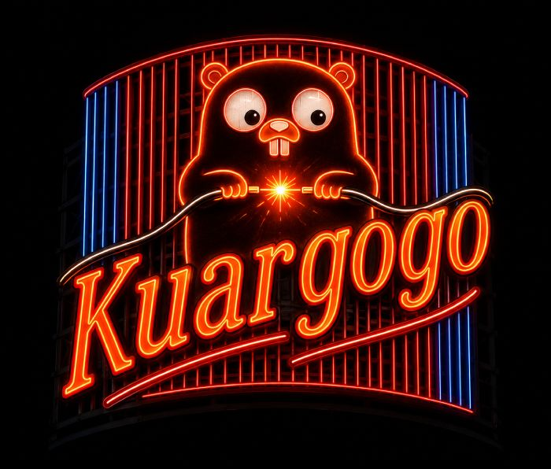

¡Bienvenidos al blog oficial de **Kuargogo**! Nos complace enormemente lanzar este nuevo portal de documentación y guías para ayudar a toda la comunidad open-source a llevar la gestión y automatización de sus homelabs al siguiente nivel.

<!-- truncate -->

**Kuargogo (`kgg`)** nace como una herramienta diseñada específicamente para administradores de sistemas y entusiastas del hardware que desean centralizar su infraestructura y sus clústeres Kubernetes K3s de manera eficiente.

A través de este blog, compartiremos actualizaciones importantes sobre el proyecto, nuevas funciones, casos de uso prácticos y guías avanzadas de SRE.

### ¿Qué puedes encontrar en este sitio?
- **Documentación oficial**: Referencia de comandos CLI y explicación detallada de la arquitectura de plano dual.
- **Guías SRE paso a paso**: Desde el formateo inicial de tus nodos con Debian hasta la exposición segura mediante túneles de Cloudflare Zero Trust.
- **IA y Automatización**: Ejemplos sobre cómo interactuar con Ollama de forma local para analizar alertas y optimizar el consumo de tus nodos.

¡Muchas gracias por acompañarnos en este viaje! Puedes explorar todo el código y contribuir directamente en nuestro repositorio de [GitHub](https://github.com/DannyStrelok/kuargogo).
